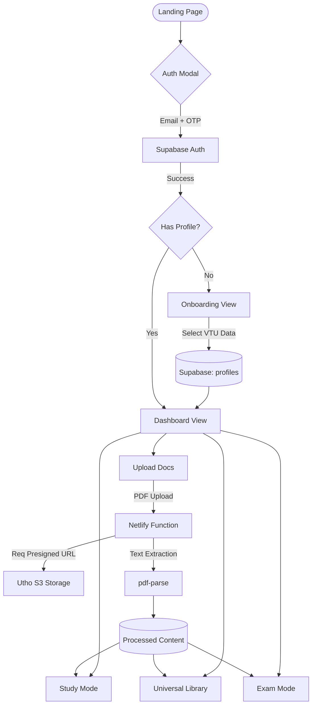

# Moduly AI: Project Knowledge Base & Onboarding Guide


---

## 1. Project Mission & Target Audience
**Moduly AI** is a specialized, AI-powered study platform designed exclusively for students of **Visvesvaraya Technological University (VTU)**.

*   **Problem:** VTU students often struggle with scattered notes, complex CBCS (Choice Based Credit System) schemes, and the pressure of periodic exams.
*   **Solution:** A centralized hub that organizes VTU-specific subjects, provides AI-generated summaries/study materials, and prepares students for exams through targeted practice modes.
*   **Target Audience:** Engineering students under VTU (primarily following the 2021 CBCS scheme).


---

## 2. Integrated Workflow (Technical Flowchart)



---

## 3. Core Functional Modules
The application is a Single Page Application (SPA) with state-driven view management.

| Module | Purpose | Key Features |
| :--- | :--- | :--- |
| **Onboarding** | Profile Setup | Collects VTU College, Branch, Semester, and Scheme to personalize the dashboard. |
| **Dashboard** | Hub for Students | Shows progress, upcoming exams (mocked), and quick access to subjects. |
| **Study Mode** | Learning Engine | AI-assisted learning. Generates summaries, key points, and explanations from uploaded notes. |
| **Exam Mode** | Practice Hub | Simulates exam environments with countdowns and specific question sets to test knowledge. |
| **Library** | Content Repo | A "Universal Library" where users can browse, search, and manage their uploaded notes/PDFs. |
| **Upload Docs**| Data Input | Securely upload study materials (PDFs) which are processed to feed the AI modes. |

---

## 3. Technical Stack (The "How It Works")

### **Frontend Architecture**
*   **Framework:** React 19 + TypeScript 5.9 + Vite.
*   **Styling:** **Vanilla CSS only.** No Tailwind, no styled-components.
    *   Responsive design and animations are handled via co-located `.css` files.
    *   Dark Mode is built-in via the `ThemeContext` and `[data-theme="dark"]` selectors.
*   **Navigation:** State-driven. Instead of `react-router`, we use `useState<AppView>` in `App.tsx` and `useState<DashboardPage>` in `Dashboard.tsx`.
*   **Icons:** Google Material Icons Outlined (`material-icons-outlined`) and custom SVGs.

### **Backend & Storage**
*   **Infrastructure:** Netlify (Hosting + Serverless Functions).
*   **Database & Auth:** **Supabase**.
    *   Auth: Email + OTP (passwordless).
    *   Database: `profiles` table to store VTU-specific user metadata.
*   **Object Storage:** **Utho (S3-Compatible)**.
    *   Handled via serverless functions (S3 SDK) to generate pre-signed URLs.
*   **Logic:** Netlify Functions handle secure backend tasks like file upload signing and document processing.

### **Integrations & Libraries**
*   **File Parsing:** `pdf-parse` for extracting text from uploaded PDFs.
*   **Animations:** `simplex-noise` for dynamic background effects.
*   **Dev Tools:** Netlify CLI for local serverless function testing.

---

## 4. Project Structure
```text
moduly-ai-landing/
├── netlify/functions/     # Serverless logic (Uploads, S3 signing)
├── public/                # Static assets & SPA redirects
├── src/
│   ├── components/        # Reusable UI (AuthModal, Nav, ThemeToggle)
│   ├── context/           # ThemeContext (Global state)
│   ├── lib/               # Utility core (Supabase client, VTU Academic Data)
│   ├── pages/             # Major views (Dashboard, Library, StudyMode)
│   ├── sections/          # Landing page building blocks (Hero, Features)
│   ├── index.css          # Global Design System (CSS Tokens)
│   └── App.tsx            # Main "Router" via state management
└── supabase/              # SQL migrations and config
```

---

## 5. Design Philosophy: "Vibe Coding"
The project prioritizes **Premium Aesthetics**.
*   **Colors:** Deep blacks, vibrant accents (Violet/Emerald), and glassmorphism.
*   **Micro-interactions:** Hover effects, smooth transitions, and dynamic SVG animations.
*   **Consistency:** Every page follows a strict BEM-prefix logic (e.g., `db-` for dashboard, `sm-` for study mode).

---

## 6. Development Workflow
To run the local environment:
1.  **Vite Dev Server:** `npm run dev` (Port 5173).
2.  **Netlify Functions (Local):** `npm run netlify` (Port 8888).
3.  **Type Checking:** `npm run build` (runs `tsc -b`).

### **Environment Variables**
Required in `.env`:
*   `VITE_SUPABASE_URL` / `VITE_SUPABASE_ANON_KEY`.
*   Utho S3 Credentials (for serverless environment).

---

## 7. Actionable Tips for New Teammates
*   **Check `src/lib/vtuData.ts`:** This is the brain for all VTU subjects and branches. If you need to add a new course, it goes here.
*   **No Class Components:** Always use named `function` declarations (see `AGENTS.md` for style rules).
*   **Vanilla is King:** Don't try to install UI libraries (Radix, Lucide, etc.) unless absolutely necessary. Build it custom with CSS.
*   **AI is Mocked:** Currently, AI results in Study/Exam modes are simulated. Integrating a real LLM endpoint (like Gemini or OpenAI) is a planned upgrade.
